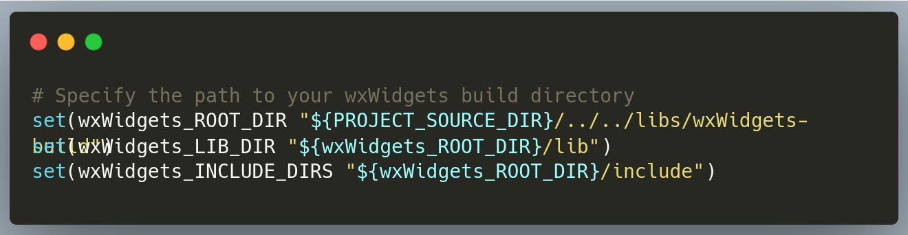

# Typing Speed App


## About the Project

This is a cross-platform typing speed app.

## Installation
### Installing wxWidgets:
download and compile the source code:
   
   [wxWidgets source code download.](https://www.wxwidgets.org/downloads/)
### Get the repository:
1. Clone the repository:

   ```sh
   https://github.com/tawfiqAK17/Typing-Speed-App.git 
   ```
2. Configure cmake file:

   - change these paths to the corresponding paths of your wxWidgets build directory:

   
